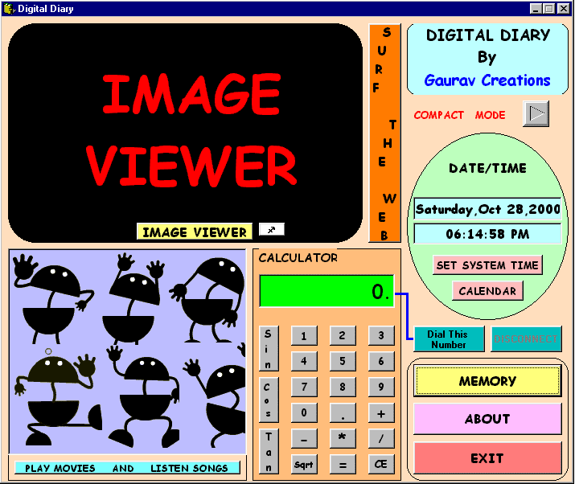



## Digital Diary\(v 2\.0\) see screenshot

### Description

Here it comes again with a cool interface a compact one(like the msoffice taskbar) and a full one(see screenshot).It has more number of functions than you can imagine.An image viewer(not a simple one).A database using Msaccess.A calculator.A Phone Dialer.An Inbuilt internet browser.Calender,time date(you can even set the system time).Play movies or MP3's as you work.It took me many days to complete.PLEASE VOTE FOR IT.visit www.gauravcreations.com for many more cool programs .
 
### More Info
 

             |
---                |---
**Submitted On**   |2000-10-28 18:22:20
**By**             |[Gaurav Creations](https://github.com/Planet-Source-Code/PSCIndex/blob/master/ByAuthor/gaurav-creations.md)
**Level**          |Beginner
**User Rating**    |4.4 (57 globes from 13 users)
**Compatibility**  |VB 6\.0
**Category**       |[Databases/ Data Access/ DAO/ ADO](https://github.com/Planet-Source-Code/PSCIndex/blob/master/ByCategory/databases-data-access-dao-ado__1-6.md)
**World**          |[Visual Basic](https://github.com/Planet-Source-Code/PSCIndex/blob/master/ByWorld/visual-basic.md)
**Archive File**   |[CODE\_UPLOAD112931142000\.zip](https://github.com/Planet-Source-Code/gaurav-creations-digital-diary-v-2-0-see-screenshot__1-12529/archive/master.zip)

